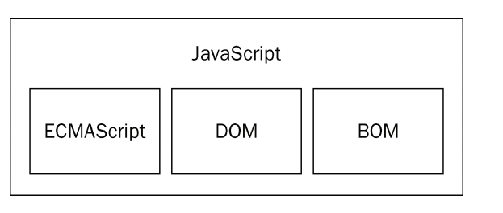

>  [TOC]
>
>  # 第十六天 开始JS
>
>  > 时间 2018 05 10
>  >
>  > 目标： 学习JS/ECMAScript，实现各种各样的交互逻辑和数据处理。了解JS/ECMAScript，学习基本的语法，有基础的可跳过
>  >
>  > 关键信息	： 交互逻辑，数据处理， js的基本语法 
>
>  ## 阅读
>
>  > 1. 首先我们阅读一些定义和历史，放轻松阅读，不用背下来 
>  >    - [W3School JavaScript](http://www.w3school.com.cn/js/js_intro.asp)
>  >    - [MDN 什么是JavaScript？](https://developer.mozilla.org/zh-CN/docs/Learn/JavaScript/First_steps/What_is_JavaScript)
>  >    - [一文读懂JavaScript和ECMAScript的区别](http://developer.51cto.com/art/201711/557514.htm)
>  >    - [W3School JavaScript历史](http://www.w3school.com.cn/js/pro_js_history.asp)
>  > 2. 我们开始学习 JavaScript 的基础语法，变量，函数等概念，你先阅读一遍，然后我们会有对应练习提供给您。 
>  >    - [《JavaScript 高级程序设计》](https://book.douban.com/subject/10546125/)
>  >    - [W3School JS教程](http://www.w3school.com.cn/js/index.asp)，从JS简介阅读到运算符
>
>  ## 知识点
>
>  > 1. JavaScript的简介
>  >
>  > > JS的出现是为了处理以前有服务端语言负责的一些输入验证操作，随着时代的发展，具备了浏览器进行交互的能力。JS学起来简单，但真正掌握和理解则很难（什么东西不少呢）。
>  > >
>  > > 一个完整的JS实现应当由三个不同的部分组成 ： 核心（ECMAScipt）、文档对象模型（DOM）、浏览器对象模型（BOM）
>  > >
>  > > 
>  >
>  > 1. ECMAScript
>  >
>  > > ECMAScript与Web浏览器没有**依赖关系**。浏览器只是ECMAScript实现可能的**宿主环境之一**，除了必要的实现，浏览器也同时提供该语言的拓展，以便对接。
>  > >
>  > > 根据ECMA-262的标准，规定这门语言的组成部分： 语法、类型、语句、关键字、保留字、操作符、对象。
>  > >
>  > > ECMAScript的版本更迭， 到现在已经是ES8（or ES2017）了。
>  > >
>  > > ```
>  > > ES6 is also called ES2015. ES7 is ES2016 and ES8 is ES2017.
>  > > ```
>  >
>  > 1. 文档对象模型（DOM）
>  >
>  > > 文档对象模型（DOM Document Object Model） 是针对XML但经过拓展的用于HTML的应用程序编程接口（API Application Programming Interface）。DOM把整个页面**映射**为一个多层节点结构。通过DOM的API，实现删除，添加，替换或修改任何节点（增，删，改，查）。
>  > >
>  > > DOM级别
>  > >
>  > > 1. DOM1级： 由两个模块组成，DOM核心（core）和DOM HTML， 注意为映射文档结构
>  > > 2. DOM2级： 在原先基础上进行扩充，DOM视图（Views）、DOM事件（Events）、DOM样式（Style）、DOM遍历和范围（Tr）。
>  > >
>  > > **DOM0级标准是不存在的，他只是DOM历史坐标中的一个参考点（在IE4中支持的DHTML）**
>  > >
>  > > **DOM并不仅仅针对JS，很多语言也都实现DOM，但在Web浏览器中，基于ES实现的DOM以及称为JS这门语言的一个重要组成部分** 
>  >
>  > 1. 浏览器对象模型（BOM）
>  >
>  > > 浏览器对象模型（BOM Browser Object Model）， 使用BOM控制浏览器显示的页面意外的部分，在HTML5中致力于把很多的BOM功能写入规范中。
>  > >
>  > > 究其根本而言，BOM只处理浏览器窗口和框架。但习惯上喜欢把所有针对浏览器的JS拓展算为BOM的一部分。
>  > >
>  > > 部分拓展：
>  > >
>  > > > 1. 弹出新浏览器窗口的功能
>  > > > 2. 移动、缩放和关闭浏览器的功能
>  > > > 3. 提供浏览器详细信息的`navigator`对象
>  > > > 4. 提供浏览器所加载页面的详细的`loaction `对象
>  > > > 5. 提供用户显示器分辨率详细信息的`screen`对象
>  > > > 6. 对`cookies`对象
>  > > > 7. 像`XMLHttpRequest`对象和 IE的`ActiveXObject的自定义对象。