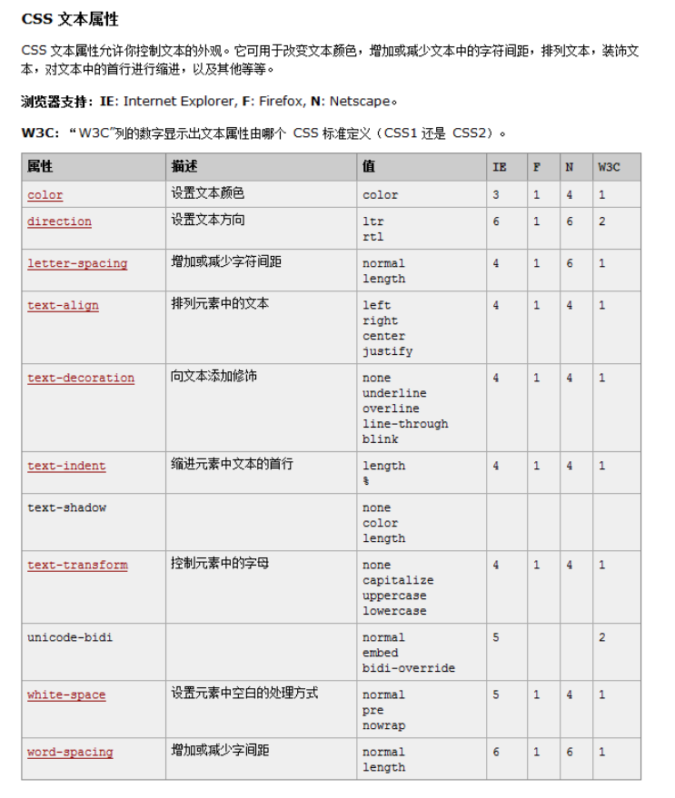

[TOC]

# 第三天： 添加样式

> 日期： 2018 04 26
>
> 目标：初步了解css，掌握基本的css概念，语法；学习如何设置一些简单的样式
>
> 关键词：css，语法，样式设置

## 任务描述

> 为先前的简历，添加基本的css样式， 一些常用样式如下。
>
> ```
> color
> font-family
> font-style
> font-weight
> font-size
> text-align
> text-decoration
> text-indent
> line-height
> text-shadow
> ```

## 参考资料

> [](https://developer.mozilla.org/zh-CN/docs/Learn/CSS/%E4%B8%BA%E6%96%87%E6%9C%AC%E6%B7%BB%E5%8A%A0%E6%A0%B7%E5%BC%8F/Fundamentals)
>
> * [W3School中的文字样式部分](http://www.w3school.com.cn/css/css_text.asp)
> * [W3School字体部分](http://www.w3school.com.cn/css/css_font.asp)
> * [MDN-CSS 介绍](https://developer.mozilla.org/zh-CN/docs/Learn/CSS/Introduction_to_CSS)
> * [MDN-CSS如何工作](https://developer.mozilla.org/zh-CN/docs/Learn/CSS/Introduction_to_CSS/How_CSS_works)
> * [MDN-CSS 语法](https://developer.mozilla.org/zh-CN/docs/Learn/CSS/Introduction_to_CSS/Syntax)
> * [MDN-选择器](https://developer.mozilla.org/zh-CN/docs/Learn/CSS/Introduction_to_CSS/Selectors)
> * [MDN-简单选择器](https://developer.mozilla.org/zh-CN/docs/Learn/CSS/Introduction_to_CSS/Simple_selectors)
> * [MDN-属性选择器](https://developer.mozilla.org/zh-CN/docs/Learn/CSS/Introduction_to_CSS/Simple_selectors)

## 今日问题

>- 什么是CSS，CSS是如何工作的
>
>  > Cascading Style Sheets 层叠样式表，是用来对网页中的字体，颜色，背景，图形，及各种元素的控制。 总而言之，它是用来控制样式的**标记语言**
>  >
>  > 1. 浏览器将HTML和CSS转化成DOM（文档对象模型），DOM在计算机内存中表示文档。它把文档内容和其样式结合在一起。
>  >
>  > 2. 浏览器显示 DOM 的内容。
>  >
>  >    
>
>- CSS的基本语法是怎样的
>
>  >```
>  >// 选择器 属性 值
>  >selectors {
>  >Propertie : Value;
>  >}
>  >```
>  >
>  >​
>
>- CSS选择器是什么概念，简单选择器和属性选择器是什么
>
>  > - **简单选择器（Simple selectors）：**通过元素类型、`class` 或 `id` 匹配一个或多个元素。
>  > - **属性选择器（Attribute selectors）**：通过 属性 / 属性值 匹配一个或多个元素。
>  >
>  > ```
>  > element, .class, #id {} //简单选择器
>  > [attr],[attr=val],[attr~=val]{} // 属性选择器
>  > ```
>  >
>  > ​
>
>- 文本样式都有哪些相关属性，对应哪些值
>
>  > 给一张图，自行体会
>  >
>  > 参考链接 ： <http://www.cnblogs.com/smyhvae/p/4855106.html>
>  >
>  > 

## 拓展阅读

> [CSS 的标准文档](https://www.w3.org/TR/2011/REC-CSS2-20110607/)   （放弃吧，偶尔查查粗略了解一下还行，这文档根本读不完，）
>
> [顾轶灵的知乎回答](https://www.zhihu.com/question/19926700/answer/13376153)
>
> [貘吃馍香的回答](https://www.zhihu.com/question/264372456/answer/280662029)
>
> [像这样回答问题](https://www.zhihu.com/question/34952563/answer/60672228)

## 其他知识

> **`containing block` ** :  包含块，可以这样理解？ **盒子的宽/高度自动值/相对值的计算，相对/浮动/绝对定位，均依赖containing block** 。可以说它很重要了。
>
> *  [CSS 中 block-level boxes、containing block、block formatting context 三者之间的区别和联系是怎样的？]()
> *  [不得不说的containing Block](http://www.cnblogs.com/fsjohnhuang/p/5295859.html)
>
> 布局 ：
>
> ​	对方丢出了一个链接，并不想理你。
>
> ​	[CSS布局](https://segmentfault.com/a/1190000008789039)
>
> 
>
> ​	