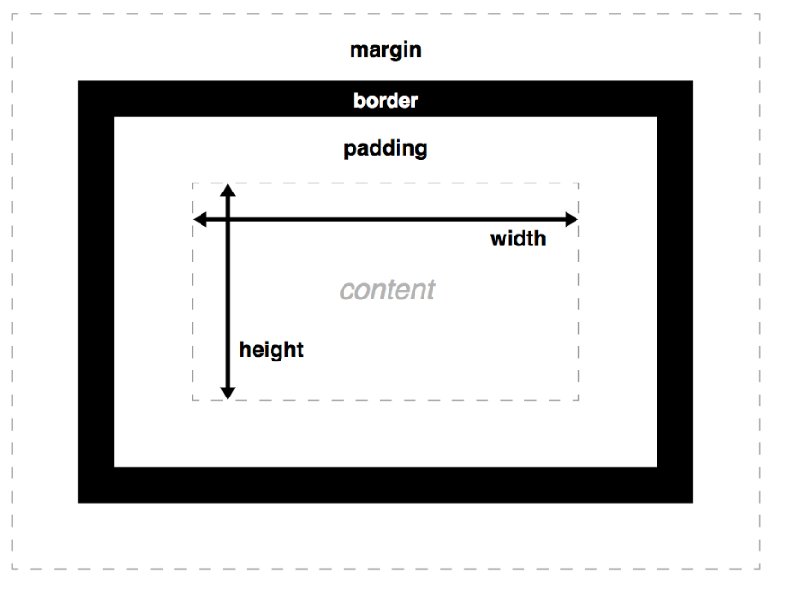
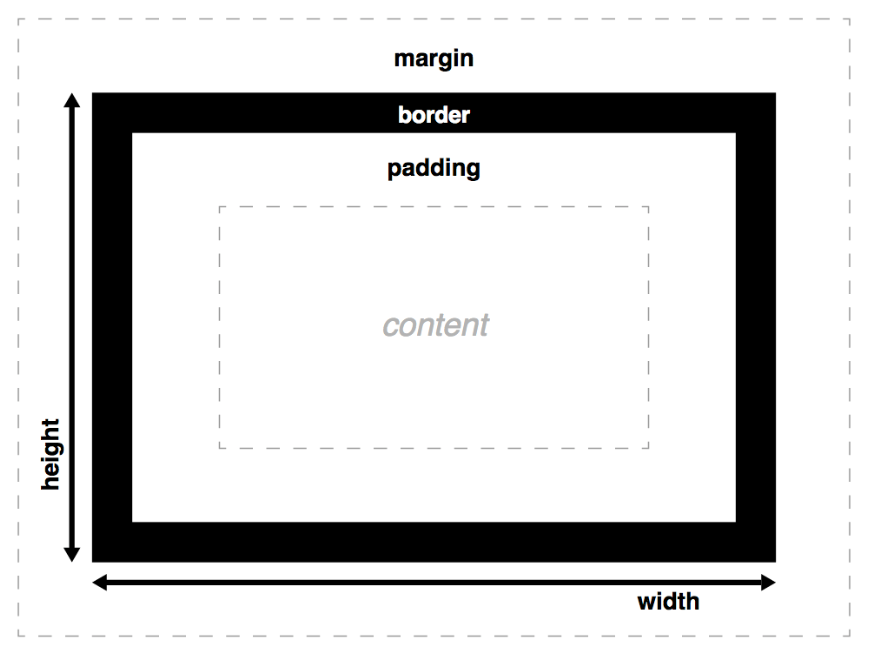

[TOC]


# 第五和第六天：三种简历

> 日期 ： 2018 04 278- 2018  04 29
>
> 目标 ： 通过阅读及一个小型练习，掌握 `CSS` 盒模型及通过`Float`进行简单的布局
>
> 关键词 ： 盒模型  `float`布局

## 参考资料

> **据说这些知识非常重要**
>
> 1. 盒模型
>    - [MDN-盒模型](https://developer.mozilla.org/zh-CN/docs/Learn/CSS/Introduction_to_CSS/Box_model)
>    - [MDN-再述盒模型](https://developer.mozilla.org/zh-CN/docs/Learn/CSS/Styling_boxes/Box_model_recap)
>    - [W3C](https://www.w3.org/TR/2011/REC-CSS2-20110607/box.html#box-model)
> 2. 浮动
>    - [MDN-浮动](https://developer.mozilla.org/zh-CN/docs/Learn/CSS/CSS_layout/Floats)
>    - [W3C 浮动](https://www.w3.org/TR/2011/REC-CSS2-20110607/visuren.html#floats)
>    - [如何理解 CSS 中的浮动布局方式？](https://www.zhihu.com/question/19915431)
>    - [What methods of ‘clearfix’ can I use?](https://stackoverflow.com/questions/211383/what-methods-of-clearfix-can-i-use)
>    - [清除浮动（clearfix hack）](http://zh.learnlayout.com/clearfix.html)
> 3. 编码规范
>    - [编码规范-百度团队](https://github.com/ecomfe/spec)
>    - [编码规范 by@mdo](https://codeguide.bootcss.com/)
>    - 适当了解一下就好，主要是规范真的很重要呀，尤其是团队合作。

## 问题

> 1. 盒模型的概念
>
>    > css框模型（盒模型）是网页布局的基础-每个元素都为一个矩形框，宽的内容（content box）（widrh height）、内边距（padding）、边界（border）、外边距（margin）
>    >
>    > 默认情况下，是这样的。
>    >
>    >  
>    >
>    > 早期IE盒模型，是这样的，便于布局计算。（css3中设置box-sizing:border-box 也是这样的）
>    >
>    >  
>    >
>    > ​
>    >
>    > ​
>
> 2. inline、block和inline-block的概念
>
>    > display 属性可以设置元素的显示方式，常用的有none， inline，block，inline-block。
>    >
>    > 每个元素都有默认的显示方式，多半是inline或block。
>    >
>    > inline: 设置元素为行内元素，不单独一行，不支持宽高，内容撑开。 eg： span
>    >
>    > block: 设置元素为块级元素，单独一行，支持宽高。 eg： h1
>    >
>    > inline-block：设置元素为行内块元素，是inline和block的结合体，不单独一行，但支持宽高。 img
>
> 3. 内外边距，宽度，高度，box-sizing等属性
>
>    > 内边距 (padding)： 指定一个元素的内容与其边界之间的空间，不能为负值。
>    >
>    > ​	`padding-top padding-right padding-bottom padding-left padding`， 其中简写属性可指定一个，两个，三个或四个值。
>    > 外边距(margin)： 给元素设置外边距属性（元素与元素的边界的距离）， 有负外边距，有外边距塌陷的情况。
>    >
>    > ​	`margin-top margin-right margin-bottom margin-left margin` 其中简写属性可指定一个，两个，三个或四个值。
>    >
>    > width： 当box-sizing为默认值时，设置内容框的宽度
>    >
>    > height： 当box-sizing为默认值时，设置内容框的高度
>    >
>    > box-sizing： 设置元素的盒模型的方式，默认为正常的盒模型（即width和height为内容框的值），设置border-sizing时，为IE盒模型（即width和高为包括边界，内边距，内容框）。
>    >
>    > ​
>
> 4. 浮动，清除浮动
>
>    > 浮动（float）： 用float属性指定一个元素沿着容器的左边或右边放置，允许文本和内联元素环绕它。当初是为了排版美观而产生，并且它不是真正意义上的脱离文档流（你可以理解为脱离了半层）。
>    >
>    > 清除浮动 ： 因为当容器的高度自动（auto），且容器的内容有浮动元素，这种情况下容器的高度不能自动伸长以适应内容的高度，使得内容溢出到容器外面而影响（甚至破坏）布局的现象。这个现象叫浮动溢出，为了防止这个现象的出现而进行的CSS处理，就叫CSS清除浮动。
>    >
>    > ```css
>    > /*最常用的方式就是，在浮动元素的父级添加一个clearfix*/
>    > .clearfix::after {
>    >   content : "";
>    >   display : block;
>    >   clear : both;
>    > }
>    > .clearfix {
>    >   /*IE6 IE7 要触发haslayout*/
>    >   zoom: 1;
>    > }
>    > /*其他方法差不多，其本质就是在需要清理浮动的元素，后面添加一个具有clear 属性的元素*/
>    > ```
>    >
>    > ​
>
> 5. 如何使用浮动进行布局
>
>    > 浮动常用于创建多列布局，最常用的是两列，三列。对于如果后面还有内容，但又不需要去环绕浮动元素，那就需要清除浮动，撑开父级的宽高。
>    >
>    > 我大概只是一个搬运工（哈哈哈）。
>    >
>    > [浮动布局的方法（总结）](https://blog.csdn.net/bingkingboy/article/details/51035652)
>    >
>    > [如何理解 CSS 中的浮动布局方式？最主要的功能是什么？如何正确地使用它？](https://www.zhihu.com/question/19915431)

## 其他知识

> 外边距塌陷
>
> > [来源：MDN](https://developer.mozilla.org/zh-CN/docs/Web/CSS/CSS_Box_Model/Mastering_margin_collapsing)
> >
> > 块级元素的[上外边距](https://developer.mozilla.org/zh-CN/docs/Web/CSS/margin-top)和[下外边距](https://developer.mozilla.org/zh-CN/docs/Web/CSS/margin-bottom)有时会合并（或折叠）为一个外边距，其大小取其中的最大者，这种行为称为**外边距折叠**（margin collapsing），有时也翻译为**外边距合并**。注意[浮动元素](https://developer.mozilla.org/zh-CN/docs/Web/CSS/float)和[绝对定位元素](https://developer.mozilla.org/zh-CN/docs/Web/CSS/position#absolute)的外边距不会折叠。
> >
> > 三种发生外边距折叠的情况：
> >
> > 1. 相邻元素之间
> > 2. 父元素与第一或最后一个元素之间
> > 3. 空的块级元素
> >
> >
>
> BFC(Block formatting Context) 块格式化上下文 
>
> > BFC是一个独立的布局环境，只有Block-level box参与， 它规定了内部的Block-level Box如何布局，并且与这个区域外部毫不相干。
> >
> > BFC布局规则
> >
> > ```
> > 1.内部的Box会在垂直方向，一个接一个地放置。
> > 2.Box垂直方向的距离由margin决定。属于同一个BFC的两个相邻Box的margin会发生重叠
> > 3.每个元素的margin box的左边， 与包含块border box的左边相接触(对于从左往右的格式化，否则相反)。即使存在浮动也是如 此。
> > 4.BFC的区域不会与float box重叠。
> > 5.BFC就是页面上的一个隔离的独立容器，容器里面的子元素不会影响到外面的元素。反之也如此。
> > 计算BFC的高度时，浮动元素也参与计算
> > ```
> >
> > 触发BFC
> >
> > ```
> > 根元素或包含根元素的元素
> > 浮动元素（元素的 float 不是 none）
> > 绝对定位元素（元素的 position 为 absolute 或 fixed）
> > 行内块元素（元素的 display 为 inline-block）
> > 表格单元格（元素的 display为 table-cell，HTML表格单元格默认为该值）
> > 表格标题（元素的 display 为 table-caption，HTML表格标题默认为该值）
> > 匿名表格单元格元素（元素的 display为 table、table-row、 table-row-group、table-header-group、table-footer-group（分别是HTML table、row、tbody、thead、tfoot的默认属性）或 inline-table）
> > overflow 值不为 visible 的块元素
> > display 值为 flow-root 的元素
> > contain 值为 layout、content或 strict 的元素
> > 弹性元素（display为 flex 或 inline-flex元素的直接子元素）
> > 网格元素（display为 grid 或 inline-grid 元素的直接子元素）
> > 多列容器（元素的 column-count 或 column-width 不为 auto，包括 column-count 为 1）
> > column-span 为 all 的元素始终会创建一个新的BFC，即使该元素没有包裹在一个多列容器中（标准变更，Chrome bug）
> > ```
> >
> > 
> >
> > 更多参考链接：
> >
> > ​	[块格式化上下文-MDN](https://developer.mozilla.org/zh-CN/docs/Web/Guide/CSS/Block_formatting_context)
> >
> > ​	[如何·理解·块格式化上下文](https://www.zhihu.com/question/28433480)