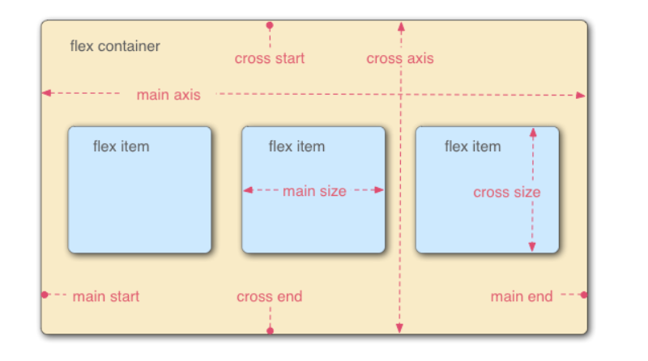
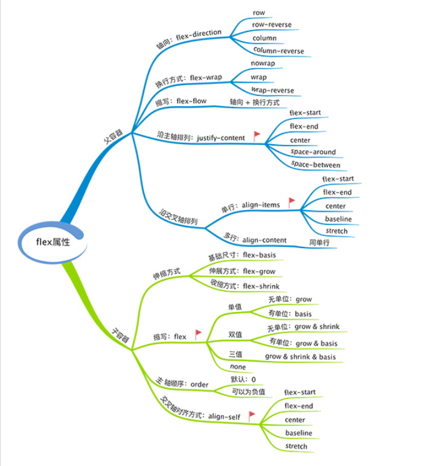

[TOC]

# 第七和第八天：学习布局

> 日期：2018 04 30 - 2018 05 01
>
> 目标 ： 通过大量练习，学习布局的各种方式
>
> 关键词： 布局

## 参考资料

> - [MDN 定位](https://developer.mozilla.org/zh-CN/docs/Learn/CSS/CSS_layout/%E5%AE%9A%E4%BD%8D)
> - [MDN 定位实战](https://developer.mozilla.org/zh-CN/docs/Learn/CSS/CSS_layout/Practical_positioning_examples)
> - [MDN Flexbox](https://developer.mozilla.org/zh-CN/docs/Learn/CSS/CSS_layout/Flexbox)
> - [学习CSS布局](http://zh.learnlayout.com/)
> - [CSS布局(三) 布局模型](http://www.cnblogs.com/chaixiaozhi/p/8481253.html)
> - [CSS布局(四) Float](http://www.cnblogs.com/chaixiaozhi/p/8481778.html)
> - [CSS布局(五) 网页布局方式](http://www.cnblogs.com/chaixiaozhi/p/8486647.html)
> - [CSS布局(六) 对齐方式](http://www.cnblogs.com/chaixiaozhi/p/8490725.html)
> - [七种实现左侧固定，右侧自适应两栏布局的方法](https://segmentfault.com/a/1190000010698609)
> - CSS布局 -- 圣杯布局 & 双飞翼布局(http://www.cnblogs.com/imwtr/p/4441741.html)
> - [CSS深入理解流体特性和BFC特性下多栏自适应布局](http://www.zhangxinxu.com/wordpress/2015/02/css-deep-understand-flow-bfc-column-two-auto-layout/)
> - [三种三栏网页宽度自适应布局方法](http://www.zhangxinxu.com/wordpress/2009/11/%E6%88%91%E7%86%9F%E7%9F%A5%E7%9A%84%E4%B8%89%E7%A7%8D%E4%B8%89%E6%A0%8F%E7%BD%91%E9%A1%B5%E5%AE%BD%E5%BA%A6%E8%87%AA%E9%80%82%E5%BA%94%E5%B8%83%E5%B1%80%E6%96%B9%E6%B3%95/)

## 练习1

> 分别尝试使用Float、Position或者Flexbox来实现如下需求：
>
> - 实现一个两栏布局，左侧占30%宽度，右侧占70%宽度
> - 实现一个两栏布局，左侧固定宽度，右侧根据浏览器宽度进行自适应变化
> - 实现一个两栏布局，右侧固定宽度，左侧根据浏览器宽度进行自适应变化
> - 实现一个三栏布局，左侧固定宽度，右侧固定宽度，中间部分宽度随浏览器宽度变化而自适应变化
> - 实现一个三栏布局，左侧固定宽度，中间固定宽度，右侧根据浏览器宽度变化而自适应变化
>
> 要求：
>
> - 每一个需求都尽可能多地用多种方式来实现
>
> **说来惭愧，只写了float**

## 练习2

> 参考如下设计稿实现HTML页面及CSS样式。
>
> - 设计稿分为头部，中间的Banner，主导航，内容区域，底部
> - 头部区域为100%宽的一个深色背景，头部中间有一块960px的定宽居中区域，里面包括了左边的Logo和右上角导航
> - Banner为100%宽的区块，中间右下方有banner轮显的当前图片数字的示例，其中正在显示的图片对应的数字有特殊样式（注意不需要实现轮显banner的业务逻辑，只是按照设计稿做静态样式）
> - 主导航区域，有一个100%宽的灰色线条，线条之上，在中间960px区域是导航菜单，当前正在浏览页对应的菜单有特殊样式
> - 主要内容区域，宽度为960px，里面每个内容都有至少80px的padding，每一个内容的宽度均为自适应，可以使用flex布局

## 问题

> 
>
> - Position相关概念及使用Postion进行布局的场景和方法
>
>   > `position` 定位 五个属性值 `static` `relative` `absolute` `fixed`  `sticky`
>   >
>   > 1. `static`  元素默认为该属性值
>   >
>   >    元素在文档常规流的布局，`top right bottom left z-index` 属性无效
>   >
>   > 2. `relative` 相对定位
>   >
>   >    不脱离文档流，相对于原先在文档流中的位置定位。
>   >
>   > 3. `absolute` 绝对定位
>   >
>   >    脱离文档流，向上寻找（祖先）含有`非static`定位祖先的元素，相对于它定位，如果没有则相对应根元素定位
>   >
>   > 4. `fixed` 固定定位
>   >
>   >    脱离文档流，元素相对于屏幕视口（viewport）定位，当祖先元素存在`transform`且 `非none`时，则相对于改祖先定位。
>   >
>   > 5. `sticky` 粘性定位
>   >
>   >    较新的一个属性，盒位置根据正常流计算(这称为正常流动中的位置)，然后相对于该元素在流中的 flow root（BFC）和 containing block（最近的块级祖先元素）定位。
>
> - Flexbox相关概念及使用Flexobx进行布局的场景和方法
>
>   > 图片来源及参考链接 ：
>   >
>   > * [flex应用场景](http://www.cnblogs.com/jeremy123/p/7423986.html)
>   > * [弹性盒子](https://developer.mozilla.org/zh-CN/docs/Learn/CSS/CSS_layout/Flexbox)
>   >
>   > flexbox 弹性盒子，一种现代布局方式。
>   >
>   > flex 模型说明 
>   >
>   > 
>   >
>   > ​
>   >
>   > flex container （flex 容器， 父元素）
>   >
>   > flex item （flex 项目， 子元素）
>   >
>   > main axis （主轴）
>   >
>   > cross axis （交叉轴）
>   >
>   > 设置flex布局后，子元素的`float` `clear` 和 `verticle-algin`属性都不起作用.
>   >
>   > flex 属性
>   >
>   > 
>   >
>   > ​
>
>
> - 掌握常用的两栏、三栏布局的各种方式
>
>   > 这个，自行搜索吧，主要就是 `浮动，负margin 定位 ` 的混合布局。
>   >
>   > 还有就是，圣杯布局，双飞翼布局，木桶布局啥的。

## 其他知识

> 圣杯布局
>
> 双飞翼布局
>
> 木桶布局
>
> 略